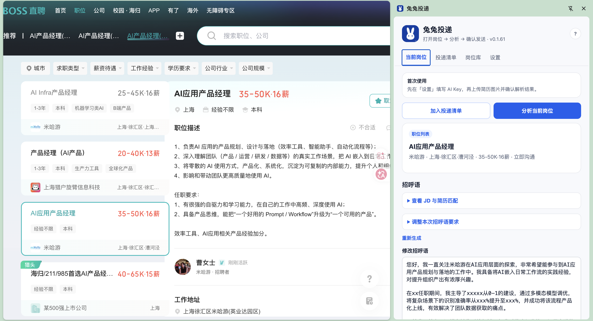
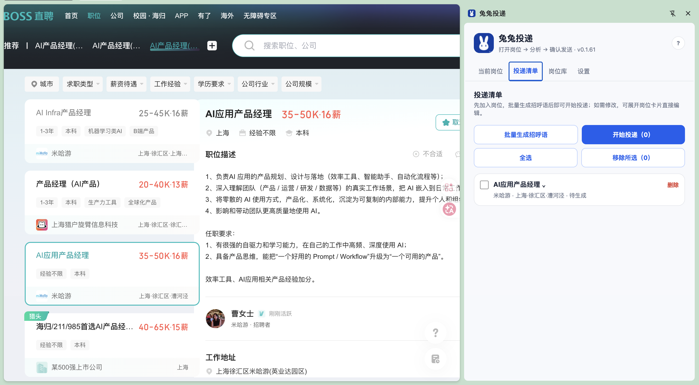
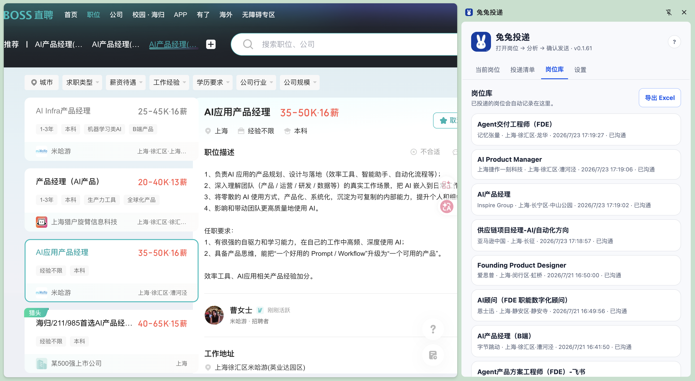
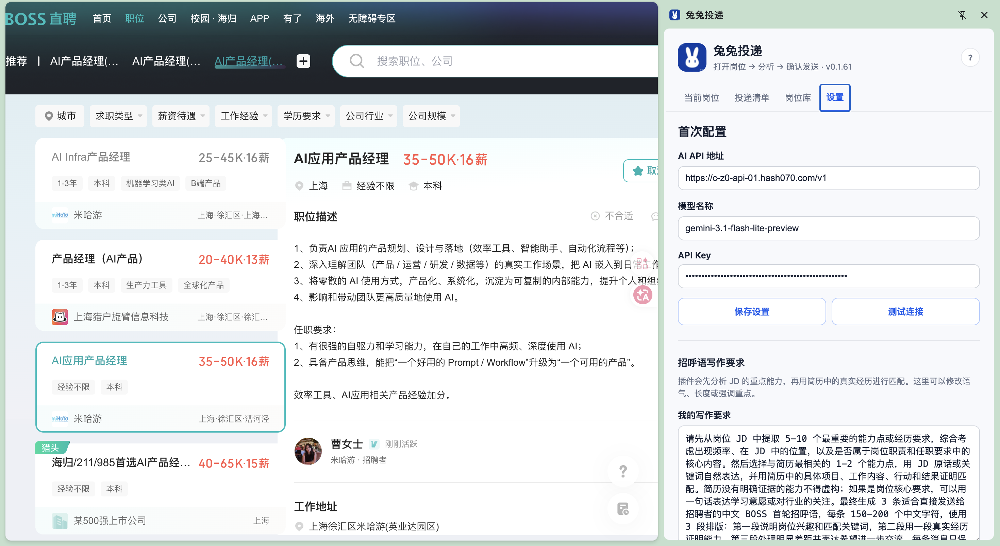
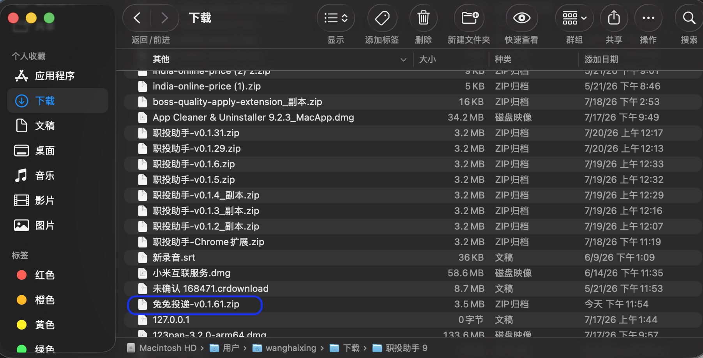
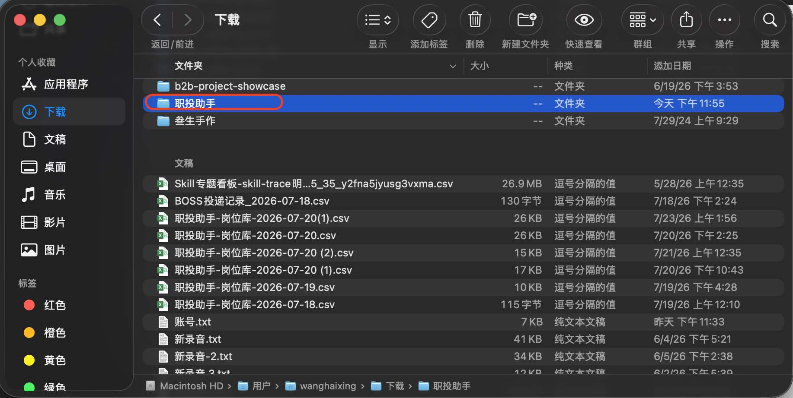
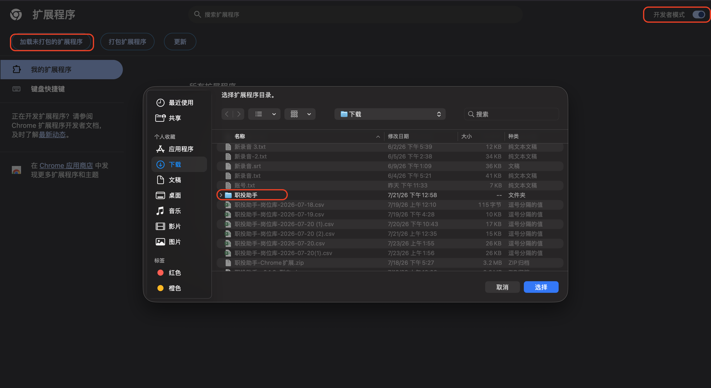

# 🐰 兔兔投递

> **在 BOSS 人工筛选岗位，用简历生成更有针对性的招呼语，再批量完成投递与记录。**

<p align="center">
  <a href="https://mumu-w-01.github.io/boss-tutu-delivery/"><strong>查看产品介绍</strong></a> ·
  <a href="https://github.com/mumu-w-01/boss-tutu-delivery/releases"><strong>下载扩展</strong></a> ·
  <a href="#-三步开始使用"><strong>安装教程</strong></a>
</p>

<p align="center">
  
</p>

## 为谁而做？

适合需要在 **BOSS 直聘海量筛选、持续投递** 的求职者。

你仍然自己判断岗位值不值得投；兔兔投递负责把岗位 JD 和你的简历放在一起，帮你形成更有针对性的招呼语，并将投递过程和记录整理好。让每次沟通不再只是复制粘贴，也更有机会被招聘者查看和邀约。

## 从筛选到记录，一条清晰流程

```text
人工筛选岗位 → 加入投递清单 → 批量生成招呼语 → 批量投递 → 导出投递记录
```

| 你来决定 | 兔兔投递来完成 |
| --- | --- |
| 哪些岗位值得投 | 读取当前岗位的标题、公司、薪资、地点与 JD |
| 想突出哪些真实经历 | 结合简历生成可编辑的中文招呼语 |
| 何时开始发送 | 串行执行投递并显示进度，保存投递结果 |

## 四个核心功能

| 功能 | 能帮你做什么 |
| --- | --- |
| **01 · 人工筛选，加入清单** | 在 BOSS 职位列表或详情页浏览；确认合适后，一键将当前岗位加入投递清单。 |
| **02 · 批量生成招呼语** | 依据岗位 JD 与你的简历内容，批量生成可修改的招呼语，减少重复写作。 |
| **03 · 批量投递** | 对清单中的岗位逐个执行投递，并显示“正在投递第 x/y 个岗位”的可见进度。 |
| **04 · 投递记录可导出** | 成功岗位进入岗位库，保留公司、岗位、时间、状态和链接，并可导出 Excel 兼容 CSV。 |

<p align="center">
  
  
</p>

<p align="center">
  
  
</p>

## 三步开始使用

### 1. 下载并解压

到 [Releases 页面](https://github.com/mumu-w-01/boss-tutu-delivery/releases) 下载 ZIP 安装包，解压后保留其中的 `职投助手` 文件夹。

### 2. 加载到 Chrome

在 Chrome 地址栏打开 `chrome://extensions`，开启右上角的「开发者模式」，点击「加载已解压的扩展程序」。

### 3. 选择文件夹并配置模型

选择解压后的 `职投助手` 文件夹。打开扩展侧边栏，在「设置」中填写 AI API 地址、模型名称和 API Key；可上传简历图片或直接粘贴简历内容。

<p align="center">
  
  
  
</p>

## 使用前请了解

- 兔兔投递只在你确认操作后执行发送；请在 BOSS 聊天页自行核对最终消息状态。
- 支持 OpenAI 兼容 API。API Key 与简历内容保存在 Chrome 本机存储中。
- 简历图片解析会发送给你配置的 AI 服务；请使用你信任的服务商。
- BOSS 页面可能更新，聊天输入框、上传入口等页面元素可能需要随之适配。

## 版本说明

当前版本：**v0.1.65**

- 新增「投递时发送简历图片」开关：关闭后，单个与批量投递均只发送招呼语，不上传简历图片。
- 支持文本模型和直接粘贴简历内容；批量生成只输出可发送的招呼语，避免冗长的匹配过程。

<details>
<summary>查看完整迭代记录</summary>

| 版本 | 更新 |
| --- | --- |
| v0.1.64 | 调整 README 首页结构，安装与使用方法优先展示。 |
| v0.1.63 | 修复介绍页安装包下载直链。 |
| v0.1.62 | 增加公开产品介绍页、功能图解和安装教程。 |
| v0.1.61 | 批量生成改用专用提示词，只输出招呼语。 |
| v0.1.59–v0.1.60 | 优化 DeepSeek Flash / 纯文本模型的 JSON 兼容与错误展示。 |
| v0.1.57 | 调整当前岗位操作区，移除不再使用的聊天历史检测。 |
| v0.1.53 | 优化投递清单按钮与岗位卡片删除操作。 |
| v0.1.39–v0.1.43 | 加入投递进度、展开详情、批量生成与移除校验。 |
</details>

---

**打开岗位 → 形成针对性招呼语 → 有条理地完成投递。**
